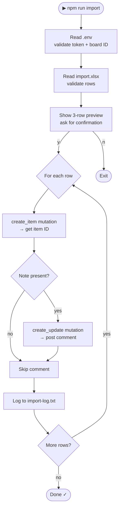

# monday-importer

> Import companies and analyst notes from Excel into Monday.com.  
> Monday's native import doesn't support comments — **this does.**


---

## Why this exists

Monday.com's built-in CSV/Excel import creates items — but silently drops your notes column. There's no way to bulk-import items **and** attach analyst comments in one step.

This CLI reads a two-column Excel file and for every row:
1. Creates a Monday item (company name)
2. Posts the analyst note as a **comment** on that item

No clicking. No copy-pasting. 500 companies in under 5 minutes.

---

## How it works



---

## Quick start

```bash
# 1. Copy the env template
cp .env.example .env

# 2. Fill in your credentials
#    MONDAY_API_TOKEN=  ← from Monday profile → Developers → My Access Tokens
#    MONDAY_BOARD_ID=   ← from your board's URL: monday.com/boards/XXXXXXXXXX

# 3. Place your Excel file in the folder
mv ~/Downloads/pipeline.xlsx ./import.xlsx

# 4. Install dependencies
npm install

# 5. Run
npm run import
```

---

## Terminal preview

```
[monday-importer] About to import 10 companies to Monday board 1234567890.
Preview:
   1. Haast Autonomous — "Strong team, drone logistics focus. Series A ready..."
   2. Forevolta — "Battery tech, interesting IP portfolio..."
   3. Carbion — "Early stage but exceptional founding team..."

Continue? (y/n): y

[monday-importer] [1/10] Haast Autonomous ✓  (item ID: 7823901234)
[monday-importer] [2/10] Forevolta ✓  (item ID: 7823901298)
[monday-importer] [3/10] Carbion ✓  (item ID: 7823901347)
...
[monday-importer] [10/10] Deepform AI ✓  (item ID: 7823901612)

[monday-importer] Done. 10/10 items imported successfully.
[monday-importer] Item IDs saved to import-log.txt
```

---

## Excel format

Prepare your file with **two columns and a header row**:

| Column A (Company Name) | Column B (Notes)                          |
|-------------------------|-------------------------------------------|
| *(header — skipped)*    | *(header — skipped)*                      |
| Haast Autonomous        | Strong team, drone logistics focus...     |
| Forevolta               | Battery tech, interesting IP portfolio... |
| Carbion                 | Early stage but exceptional founders...   |

**Rules enforced automatically:**

| Rule | Behaviour |
|---|---|
| Row 1 | Always skipped (treated as header) |
| Empty company name | Row skipped with a warning |
| Company name > 255 chars | Truncated to 255 (Monday's limit) |
| More than 500 rows | First 500 imported, rest skipped with a warning |
| Empty note | Item still created, comment step skipped |
| File > 50MB | Rejected before parsing |
| Symlink instead of real file | Rejected |

Save as `.xlsx` (not `.xls` or `.csv`).

---

## Configuration

Copy `.env.example` to `.env` and fill in both values:

```bash
MONDAY_API_TOKEN=your_monday_api_token
MONDAY_BOARD_ID=1234567890
```

### Getting your API token

1. Log into Monday.com
2. Click your **profile picture** (bottom-left)
3. Go to **Developers → My Access Tokens**
4. Click **Show** next to your personal token and copy it

### Getting your board ID

Open your board in Monday. The URL looks like:

```
https://monday.com/boards/1234567890
                           ^^^^^^^^^^^
                           This is your board ID
```

---

## Error handling

The importer is designed to be **safe to run on production data**:

| Situation | What happens |
|---|---|
| Wrong API token | Startup error — nothing imported |
| Board ID not numeric | Startup error — nothing imported |
| `import.xlsx` missing | Startup error — nothing imported |
| Single row API failure | Warning logged, next row continues |
| Monday rate limit (429) | Waits 60 seconds, retries once |
| 3 consecutive failures | Stops with progress count, saves position to log |
| Corrupted Excel file | Clean error message, no crash |

---

## Safety guard

This tool can **only create** — it cannot modify or delete anything.

Every GraphQL call is checked before sending. These operations are **hard-blocked** and will throw before any network request is made:

```
delete  •  archive  •  move_item  •  update_item  •  clear_item
duplicate_item  •  change_column_value  •  change_simple_column_value
change_multiple_column_values
```

Only `create_item` and `create_update` are allowed through.

**Your existing Monday data is 100% safe.**

---

## Security

This tool was hardened for use with sensitive VC deal flow data:

- **Token never logged** — error messages use fixed strings, never raw API responses
- **Placeholder detection** — exits immediately if token is still `your_token_here`
- **GraphQL variables** — user data passed as variables, never interpolated into query strings (prevents injection)
- **No string interpolation** in any mutation
- **Symlink check** — `lstatSync` rejects symlinked `import.xlsx` before reading
- **HTML stripped** from notes before posting (`<script>` tags and all HTML removed)
- **Formula injection defused** in `import-log.txt` (values starting with `=`, `+`, `-`, `@` are prefixed with `'`)
- **Exact dependency pins** — no `^` or `~` ranges; supply chain compromises can't silently upgrade deps
- **No `node-fetch`** — uses Node 20+ native fetch; one fewer third-party dependency
- **Token masking** — `maskToken()` applied in all fetch error paths
- **Early item ID logging** — item ID written to `logs/import-log.txt` immediately after creation, before the comment step. If a comment fails, the log proves the item exists and won't be duplicated on retry.
- **Dedup on resume** — on each run the log is read first; any company already present with a logged item ID is skipped automatically.

> **Use a dedicated Monday API token with limited permissions for this tool, not your personal admin token.**
> Create a separate Monday user (or API token scoped to this workspace) with access only to the specific boards this tool needs. If the token is ever compromised, blast radius is limited to those boards — not your entire workspace including LP data, portfolio tracking, and fund management boards.

---

## Files

```
monday-importer/
├── import.js         ← CLI entry point: preview, confirm, import loop
├── monday.js         ← Monday GraphQL API client + safety guard
├── excel.js          ← Excel reader with validation
├── utils.js          ← Shared: logger, constants, stripHtml, validateEnv
├── tests/
│   ├── safety.test.js   ← 11 tests: destructive op blocking
│   └── security.test.js ← 10 tests: injection, pollution, token leak
├── .env.example      ← Credential template
├── .npmrc            ← Enforces Node >= 20 at install time
├── .env              ← Your credentials (git-ignored)
├── import.xlsx       ← Your data file (git-ignored)
└── logs/
    └── import-log.txt  ← Created item IDs, used for dedup (git-ignored)
```

---

## Requirements

- **Node.js >= 20.0.0** (uses native fetch — not available below v18; v20 recommended for security patches)
- A Monday.com account with API access
- An `.xlsx` file (not `.xls` or `.csv`)

Check your Node version:

```bash
node --version
```

If you use nvm, the included `.nvmrc` pins the version automatically:

```bash
nvm use
```

---

## Known issues

### uuid vulnerability in exceljs (moderate)

`npm audit` reports 2 moderate-severity findings in `uuid < 11.1.1` (GHSA-w5hq-g745-h8pq), a transitive dependency pulled in by `exceljs >= 3.5.0`.

**Why it's not fixed here:** The only available fix is `npm audit fix --force`, which downgrades `exceljs` to `3.4.0` — a breaking API change that removes features this tool depends on.

**Risk in this context:** The vulnerable `uuid` code path is in v3/v5/v6 UUID generation with a caller-supplied buffer. This tool never calls `uuid` directly; it is used internally by exceljs for worksheet cell tracking. Exploitation requires an attacker to control the buffer argument at the call site, which is not possible through normal Excel file parsing.

**Mitigation:** Watch for an `exceljs` release that updates its `uuid` dependency to >= 11.1.1. When it ships, update the pinned version in `package.json` and re-run `npm install`.

---

## Troubleshooting

**`MONDAY_API_TOKEN is not set or still contains the placeholder value`**  
→ You haven't filled in `.env`. Run `cp .env.example .env` then add your real token.

**`MONDAY_BOARD_ID must be numeric`**  
→ Copy the number from your board URL, not the board name.

**`import.xlsx not found`**  
→ The file must be named exactly `import.xlsx` and placed in the same folder as the script.

**`Cannot read import.xlsx: ... Make sure the file is a valid .xlsx file`**  
→ The file is corrupted or saved in the wrong format. Re-export from Excel/Google Sheets as `.xlsx`.

**`Invalid API token — check MONDAY_API_TOKEN`**  
→ Your token has expired or was copied incorrectly. Regenerate it in Monday's developer settings.

**`Monday API appears to be down after 3 consecutive failures`**  
→ Monday had an outage. Check [status.monday.com](https://status.monday.com). Re-run when it recovers — `import-log.txt` shows which items were already created.
